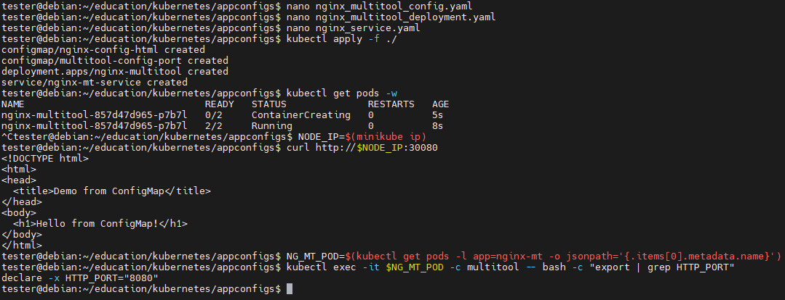
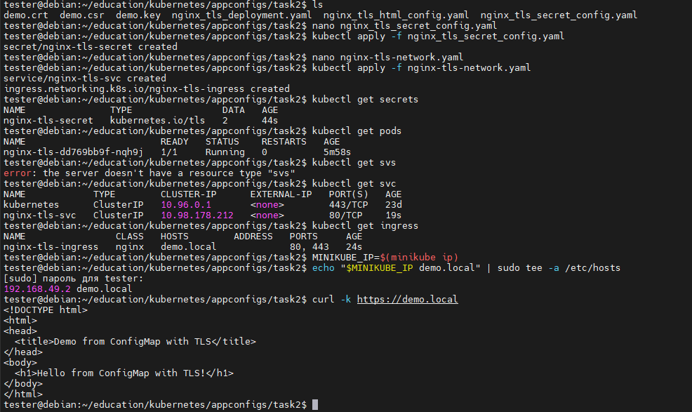

# Домашнее задание к занятию «Конфигурация приложений»

## Описание заданий

https://github.com/netology-code/kuber-homeworks/blob/main/2.3/2.3.md

### Цель задания

В тестовой среде Kubernetes необходимо создать конфигурацию и продемонстрировать работу приложения.

------

### Чеклист готовности к домашнему заданию

1. Установленное K8s-решение (например, MicroK8s).
2. Установленный локальный kubectl.
3. Редактор YAML-файлов с подключённым GitHub-репозиторием.

------

### Инструменты и дополнительные материалы, которые пригодятся для выполнения задания

1. [Описание](https://kubernetes.io/docs/concepts/configuration/secret/) Secret.
2. [Описание](https://kubernetes.io/docs/concepts/configuration/configmap/) ConfigMap.
3. [Описание](https://github.com/wbitt/Network-MultiTool) Multitool.

------

### Задание 1. Создать Deployment приложения и решить возникшую проблему с помощью ConfigMap. Добавить веб-страницу

1. Создать Deployment приложения, состоящего из контейнеров nginx и multitool.
2. Решить возникшую проблему с помощью ConfigMap.
3. Продемонстрировать, что pod стартовал и оба конейнера работают.
4. Сделать простую веб-страницу и подключить её к Nginx с помощью ConfigMap. Подключить Service и показать вывод curl или в браузере.
5. Предоставить манифесты, а также скриншоты или вывод необходимых команд.

------

### Задание 2. Создать приложение с вашей веб-страницей, доступной по HTTPS 

1. Создать Deployment приложения, состоящего из Nginx.
2. Создать собственную веб-страницу и подключить её как ConfigMap к приложению.
3. Выпустить самоподписной сертификат SSL. Создать Secret для использования сертификата.
4. Создать Ingress и необходимый Service, подключить к нему SSL в вид. Продемонстировать доступ к приложению по HTTPS. 
5. Предоставить манифесты, а также скриншоты или вывод необходимых команд.

------

## Выполнение заданий

### Чек окружения

```
Debian 12 x86_64

minikube - https://minikube.sigs.k8s.io/docs/start/

docker - https://www.docker.com/get-started/

local kubectl - https://kubernetes.io/docs/tasks/tools/install-kubectl-linux/

# docker ready

# install minikube
curl -LO https://storage.googleapis.com/minikube/releases/latest/minikube_latest_amd64.deb
sudo dpkg -i minikube_latest_amd64.deb
minikube start
minikube status

# local kubectl
curl -LO "https://dl.k8s.io/release/$(curl -L -s https://dl.k8s.io/release/stable.txt)/bin/linux/amd64/kubectl"
sudo install -o root -g root -m 0755 kubectl /usr/local/bin/kubectl
kubectl version --client
kubectl get nodes

```

### Решение 1

Создаём ConfigMap для страницы nginx и настройки порта multitool для избежания конфликта с nginx через nginx_multitool_config.yaml
```
apiVersion: v1
kind: ConfigMap
metadata:
  name: nginx-config-html
data:
  index.html: |
    <!DOCTYPE html>
    <html>
    <head>
      <title>Demo from ConfigMap</title>
    </head>
    <body>
      <h1>Hello from ConfigMap!</h1>
    </body>
    </html>
---
apiVersion: v1
kind: ConfigMap
metadata:
  name: multitool-config-port
data:
  HTTP_PORT: "8080"
```

Создаём Deployment с nginx и multitool через nginx_multitool_deployment.yaml
```
apiVersion: apps/v1
kind: Deployment
metadata:
  name: nginx-multitool
spec:
  replicas: 1
  selector:
    matchLabels:
      app: nginx-mt
  template:
    metadata:
      labels:
        app: nginx-mt
    spec:
      containers:
        - name: nginx
          image: nginx:latest
          ports:
            - containerPort: 80
          volumeMounts:
            - name: html
              mountPath: /usr/share/nginx/html
        - name: multitool
          image: wbitt/network-multitool
          # ports:
          #  - containerPort: 8080   # фиксируем порт в манифесте, реальный будет из env
          command: ["sh", "-c", "sleep infinity"]
          envFrom:
          - configMapRef:
              name: multitool-config-port
      volumes:
        - name: html
          configMap:
            name: nginx-config-html
```

Создаём Service для тестирования nginx из Deployment через nginx_service.yaml
```
apiVersion: v1
kind: Service
metadata:
  name: nginx-mt-service
spec:
  selector:
    app: nginx-mt
  ports:
    - name: http-nginx
      protocol: TCP
      port: 80
      targetPort: 80
      nodePort: 30080
  type: NodePort
```

Поднимаем всё и дожидаемся успешности развёртывания всех контейнеров
```
kubectl apply -f ./
kubectl get pods -w
```

Делаем проверку nginx кастомной страницы через сервис и заодно установки переменной окружения в multitool
```
NODE_IP=$(minikube ip)
curl http://$NODE_IP:30080

NG_MT_POD=$(kubectl get pods -l app=nginx-mt -o jsonpath='{.items[0].metadata.name}')
kubectl exec -it $NG_MT_POD -c multitool -- bash -c "export | grep HTTP_PORT"
```


Чистим всё
```
kubectl delete -f ./
```

### Решение 2

Включаем Ingress‑controller
```
minikube addons enable ingress
# Подождём, пока под ingress‑controller будет готов
kubectl -n ingress-nginx wait --for=condition=ready pod -l app.kubernetes.io/component=controller --timeout=120s
```

Создаём страницу для nginx_tls через nginx_tls_html_config.yaml
```
apiVersion: v1
kind: ConfigMap
metadata:
  name: nginx-tls-html
data:
  index.html: |
    <!DOCTYPE html>
    <html>
    <head>
      <title>Demo from ConfigMap with TLS</title>
    </head>
    <body>
      <h1>Hello from ConfigMap with TLS!</h1>
    </body>
    </html>
```

Создаём Deployment приложения, состоящего из Nginx через nginx_tls_deployment.yaml
```
apiVersion: apps/v1
kind: Deployment
metadata:
  name: nginx-tls
spec:
  replicas: 1
  selector:
    matchLabels:
      app: nginx-tls
  template:
    metadata:
      labels:
        app: nginx-tls
    spec:
      containers:
        - name: nginx
          image: nginx:latest
          ports:
            - containerPort: 80
          volumeMounts:
            - name: page
              mountPath: /usr/share/nginx/html
      volumes:
        - name: page
          configMap:
            name: nginx-tls-html
```

Готовим сертификат и ключ
```
# Ключ
openssl genrsa -out demo.key 2048

# CSR (заполняем только Common Name = demo.local)
openssl req -new -key demo.key -out demo.csr -subj "/CN=demo.local/O=Demo Inc."

# Самоподписной сертификат (valid 365d)
openssl x509 -req -days 365 -in demo.csr -signkey demo.key -out demo.crt

# Проверяем
openssl x509 -in demo.crt -noout -text | grep Subject
```

Создаём данные tls для nginx_tls через nginx_tls_secret_config.yaml
```
apiVersion: v1
kind: Secret
metadata:
  name: nginx-tls-secret
type: kubernetes.io/tls
data:
  # $(cat demo.crt | base64 -w0)
  tls.crt: LS0tLS1CRUdJTiBDRVJUSUZJQ0FURS0tLS0tCk1JSUMyVENDQWNFQ0ZHS1c3WC9GSTRaZ2loOHU4VURRK0oxZStIbmNNQTBHQ1NxR1NJYjNEUUVCQ3dVQU1Da3gKRXpBUkJnTlZCQU1NQ21SbGJXOHViRzlqWVd3eEVqQVFCZ05WQkFvTUNVUmxiVzhnU1c1akxqQWVGdzB5TlRFdwpNREl5TVRNeE16bGFGdzB5TmpFd01ESXlNVE14TXpsYU1Da3hFekFSQmdOVkJBTU1DbVJsYlc4dWJHOWpZV3d4CkVqQVFCZ05WQkFvTUNVUmxiVzhnU1c1akxqQ0NBU0l3RFFZSktvWklodmNOQVFFQkJRQURnZ0VQQURDQ0FRb0MKZ2dFQkFJNnJvY2VnY0RBSDRYTlJkcWZaZFdab3l1ZEVDcjBrdVZpSFhZUlJJUVB3bGdsdVNYLzMwMmdxTnZvZQpTOWZERmhJYWxXcWkvcncxcDFHWjc2NThTSitEMDFTYlFiOWhaN3Y0MTErcjdVS3ZjVmpYUVFzbHluNTVOK3JzCmc0R0FMZTB2TUhITU16cUExQ3pKMytOODg5K1pIazVjZEJjQUpsWFBlOFd4c0o3dVBVV05HdStXeGVsYkZWcjUKemoxYlBRUWdiVTYyRW1xUGNFa2lIWVhzdDlTaHI4T3dvL2h3VXBFNHA5Ty9oQzJUTi9Hc29WQTFnNGhKbzRkdgozdHBDQlJ1cHlhckw4VHVDYzI1OGpxL0xkMm81eTd2QTJETWt5SmZIVWthL1cvcGFSQUFkMWU5aW1jTFdhbHZVCnhWRFUyTDFQY0d4dHdiTy91OGIwK29BaXlkc0NBd0VBQVRBTkJna3Foa2lHOXcwQkFRc0ZBQU9DQVFFQWR1ZDkKbWJ2NklhM3lXU3R4dWl1d3FlcWVreWl2aUlOamVhVHo2Nlg4UFErZHFMYzg2RkNzemYzNEpqMDJ3R1BtWlREKwpqall5dXpVRVlFM0xTMElxSXpldkcrZGx1Q0xiRWpYNHV2TU9DUTI0eU5lRXVIdHFFR0N0N3VTWmZXQXl2OWxRCkkwVEY1Wm52a2tJcW50RUNGMXI5N1REVzJ3Vm9NbVhuQXorL3N5Z0VXS3ZPV2xYUGMwZHNiYjJoUTZvdUFybHgKcUdNbmU3Qm9hcmpjZkRUeUV1SnJKZlJUc1NTMmY5WE9LZC9HckRXT1dKYVdJYlpUTVg0YmJ5eC8zL3JSVTFtcgpRVWRVU3VoQnJkNVlkbWZ0Q0tnVEZjTlVkK0RSbDJYUFA2Vlg4VnhWZTNSS2c3c2JqS2diaml5OHVYY0UrTGw4ClVDazVFV2dDd3NZQm1hcnNZUT09Ci0tLS0tRU5EIENFUlRJRklDQVRFLS0tLS0K
  # $(cat demo.key | base64 -w0)
  tls.key: LS0tLS1CRUdJTiBQUklWQVRFIEtFWS0tLS0tCk1JSUV2QUlCQURBTkJna3Foa2lHOXcwQkFRRUZBQVNDQktZd2dnU2lBZ0VBQW9JQkFRQ09xNkhIb0hBd0IrRnoKVVhhbjJYVm1hTXJuUkFxOUpMbFloMTJFVVNFRDhKWUpia2wvOTlOb0tqYjZIa3ZYd3hZU0dwVnFvdjY4TmFkUgptZSt1ZkVpZmc5TlVtMEcvWVdlNytOZGZxKzFDcjNGWTEwRUxKY3ArZVRmcTdJT0JnQzN0THpCeHpETTZnTlFzCnlkL2pmUFBmbVI1T1hIUVhBQ1pWejN2RnNiQ2U3ajFGalJydmxzWHBXeFZhK2M0OVd6MEVJRzFPdGhKcWozQkoKSWgyRjdMZlVvYS9Ec0tQNGNGS1JPS2ZUdjRRdGt6ZnhyS0ZRTllPSVNhT0hiOTdhUWdVYnFjbXF5L0U3Z25OdQpmSTZ2eTNkcU9jdTd3Tmd6Sk1pWHgxSkd2MXY2V2tRQUhkWHZZcG5DMW1wYjFNVlExTmk5VDNCc2JjR3p2N3ZHCjlQcUFJc25iQWdNQkFBRUNnZ0VBSXZiQzdnWk9tQ2JHUkptWlI2ZE9VeXVwVmlYaHI5clpKVzMvS0JjdHpTWmYKenEzZGkyUHp4bHBhSU0vZDdHR2QvZy9Qd0ZOenRESTk4QXlXcFo5RnVQbjRoNHFKQVZyZ3JqdGNwTkNnazdBbApTZzF1bmtuRHAxMFRyQm9NWEdkS1dnOHZneVAxQmdoZWR4OStJK1VTYXlDK1Fadjh3MHBCR3RSL1U4S3BNemwzCngvUTR4dURLaGx6cWFYN2w5WnVIRjVJWGFUMHVSTVRqYjY1eU5VVzJET2EwT3BXYnJValNFb3VOS3NENDljUmUKbVVFWVYzWFVJcWZiaEhOUklIU2tuaDFrLzB3OU54M2tVdDhsSTNmbEJYazdsbDRORTh3ejJaSTFBUjRRUGxlcQpmTUFreS8wMWN6cmtLd0ZBWkRCRGNtQStuMjh5aUxXR3puYUx4RG8xS1FLQmdRREZhc2VzeklucE50eExXNGZDCjlhbGxiaDA1Y2YyWlBPaENhcmxGMUxLLzBuT3J2ZS9vYWd5VjhRcS9sL0pMczVtSUJKVmVZRVMways5VHo3ZnMKaTJkMWZTdWd3ZWNTVnhzL2JZakQzZWVJWE81ODlneU9oUGc4czhmbHBVcHo5ak5sRnp3Mk5aWGVSb1Z5SzF2VQo2dHB6VWFTZGlLcVR4ZkowVDVPa1VXNCtod0tCZ1FDNUFlYm9Lb1JGdS96dmkwcVdVMnNQa0NERktMR0lIVHV1CmhXdzFIZHFFLzBoZ2k0eWptZXZ5bzA4MWRFM1NxU3FJL2hwWUhKVnZiRWVZa2lzWko5SituYVhZd1ptZEJvOG4KNExNa2dBcTQya2phSXFiVCtMZWpSdTZBN3A0T1AzcW1haGN6OFV6UUlzZTU4c1BVeU5yTFk3d0ZzWEgwSG1waQpTczc2blh1N0RRS0JnSEFvOUh6V1VGd3hrUU0zWTNCK2hkbGNzRG5jNjRuT010N1pKNTNtOUE5TGovQTVIejVhClVnQTJURGNDS3VTYmkxVGQxY2NpeHFZWmpsVjlwQzgrSEcrQngvR3plSWJRK21nVTRTajJ2LzZYWGQrZEl4RXQKdHFNMk9SSGQwT2tGTGJuM2Mzd1JBYTZoUGx2WkNubHpYTjA3dTF6Tk1xeDJRQU9ZMm5iMjFMMnRBb0dBZUNpaApGU2NRRTg2ZDMrTURCWkdXVmx4UXZGekt1VkhyUWxWTHkwL2hia0h6ZXlrSHBmWkJoYXpGdEQwZWtuVG11R1Q1CkxVTWJWMnZuTUZPM0JEYVdBMEJXeCtvdDRBdXpqTDNtL0F6aGFkLzBNeUVRWTFvRncxazliS1lPSjhqWTJ4N0sKaFNUeXM3ZnpLblZlOVdPaW56amVsSUFFTi81Tk1CdlFSSHRtTWowQ2dZQVVrd2MvZzRXZjJ3NkNtZk5jSUFJTAo5M1Z2SzNRYnlzZkdTVVowWW9ZWVJvSjlaSmV5VFo3aHlSMkd3Q1pXR0hKU3pjMUIycERCNHcwcWZjZ3hvT1BDCmk3WnZ2NHlzTFlPRjVMVENML1Byb0k0b2FrSXNUMmpIaU1OSW5QdnlRbElMRHppKzN5YlJ2eHd2V1NSeFlmZVgKbHdZM0ZLRFk2bGJ5OCttSWxpSzc0Zz09Ci0tLS0tRU5EIFBSSVZBVEUgS0VZLS0tLS0K
```

Создаём Ingress c TLS и необходимый Service через nginx-tls-network.yaml
```
apiVersion: v1
kind: Service
metadata:
  name: nginx-tls-svc
spec:
  selector:
    app: nginx-tls
  ports:
    - protocol: TCP
      port: 80
      targetPort: 80
  type: ClusterIP
---
apiVersion: networking.k8s.io/v1
kind: Ingress
metadata:
  name: nginx-tls-ingress
  annotations:
    nginx.ingress.kubernetes.io/ssl-redirect: "true"
spec:
  tls:
    - hosts:
        - demo.local # должно совпадать с CN сертификата
      secretName: nginx-tls-secret
  rules:
    - host: demo.local
      http:
        paths:
          - path: /
            pathType: Prefix
            backend:
              service:
                name: nginx-tls-svc
                port:
                  number: 80
```

Поднимаем всё и дожидаемся успешности развёртывания всех контейнеров
```
kubectl apply -f ./
kubectl get pods -w
```

Проверяем доступ к nginx_tls по HTTPS
```
# Узнаём IP minikube‑node (или любой внешний IP, который будет отвечать на Ingress)
MINIKUBE_IP=$(minikube ip)

# Добавляем запись в /etc/hosts
echo "$MINIKUBE_IP demo.local" | sudo tee -a /etc/hosts

# Запускаем tunnel (нужен один терминал) # Не всегда нужно
minikube tunnel

# В другом терминале делаем запрос
curl -k https://demo.local   # -k – игнорировать самоподпись
```


Чистим всё
```
kubectl delete -f ./
minikube addons disable ingress

# Сначала получаем IP, который был записан
MINIKUBE_IP=$(minikube ip)
# Затем удаляем ровно строку из hosts
sudo sed -i.bak -e "\|^${MINIKUBE_IP}[[:space:]]\+demo\.local$|d" /etc/hosts
```